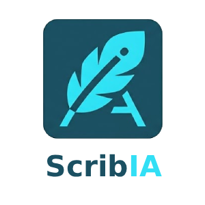

<p align="center">
  
</p>

<h1 align="center">ScribIA</h1>

<p align="center"><em>Scriba + IA — the AI scribe that keeps your documentation in sync with your code.</em></p>

<p align="center">
  <a href="LICENSE"></a>
  
  
  
</p>

---

Scribia is an incremental documentation system for AI-assisted development. When you run `/scribia` in Claude Code (or `scribia run` in your terminal), it detects what changed since the last run, extracts semantic entities (APIs, classes, models, config), updates only the impacted documentation sections, and optionally syncs a knowledge graph (Graphify) or LLM wiki.

It also captures **conversational context** — the architectural decisions, motivations, and design rationale that you explain during development — and writes them to `docs/decisions/`. Code alone doesn't explain *why*; Scribia does.

It never regenerates everything from scratch. It never deletes existing content. It only patches what changed.

---

## Why Scribia

Every AI-assisted workflow has the same problem: code evolves fast, documentation doesn't. Scribia sits between your git history and your docs directory. Run it when you're ready, get only the diff applied to your docs.

- **Manual only** — you decide when to update. No background daemons, no hooks.
- **Incremental** — compares to the last checkpoint, touches only affected sections.
- **Backend-agnostic** — Markdown, Graphify, LLM Wiki, or your own plugin.
- **Claude Code skill** — invoke with `/scribia` directly from your AI session.
- **Standalone CLI** — works without Claude too: `scribia run`.
- **Context-aware** — captures architectural decisions from your conversations, not just code changes.

---

## Installation

### Requirements

- Python 3.11+
- git

### Quick install

```bash
git clone https://github.com/marcolettieri/scribia.git
cd scribia
./install.sh
```

The installer will ask three questions:

1. **Primary documentation backend** — Markdown (default), LLM Wiki, Graphify, or custom
2. **Knowledge backends** — optional graph/wiki layers to run alongside the primary
3. Confirms manual-only update mode

It then installs the Python package, creates `scribia.yaml` in your project, and links the Claude Code skill.

### Manual install

```bash
pip install -e .
```

To use as a Claude Code skill:

```bash
ln -s "$(pwd)" ~/.claude/skills/scribia
```

### Initialize in your project

Navigate to your project and run:

```bash
scribia init
```

This scaffolds the `docs/` directory, creates `.scribia/state.json` with the current HEAD as checkpoint, and copies `scribia.yaml` from the template.

---

## Usage

### In Claude Code

```
/scribia                          # detect changes, update docs
/scribia init                     # scaffold docs/ + set initial checkpoint
/scribia --dry-run                # preview what would be documented
/scribia --force                  # reprocess even if already at HEAD
/scribia --from-commit abc1234    # override start commit
/scribia state show               # inspect last checkpoint
/scribia state reset              # move checkpoint to current HEAD
/scribia config                   # show effective configuration
/scribia backends                 # list available backends

# Conversational context capture
/scribia note "why we chose X over Y"   # queue an architectural note
/scribia session show                   # review session-captured context
/scribia session apply                  # push session context into docs
/scribia session clear                  # discard session log
```

### In terminal

```bash
scribia run                       # same as /scribia
scribia run --dry-run
scribia run --from-commit abc1234
scribia init
scribia state show
scribia state reset
scribia config
scribia backends

# Context notes
scribia note "rationale text"     # queue a note for next run
scribia session show              # review session log
scribia session apply             # apply session log to docs
scribia session clear             # clear session log
scribia session capture           # read Stop hook stdin → session log
```

---

## How it works

```
git diff (from checkpoint → HEAD)
        │
        ▼
   Diff Engine          — identifies changed files, additions/deletions
        │
        ▼
 Semantic Analyzer      — extracts APIs, classes, models, config entries
        │                  filters formatting noise
        ▼
Documentation Updater   — writes only impacted sections using safe markers
        │                  never deletes, never overwrites unmanaged content
        ▼
  Backend Plugin(s)     — Markdown / Graphify / LLM Wiki / custom
        │
        ▼
 Checkpoint saved       — .scribia/state.json updated to current HEAD
```

### Safe write contract

Every managed section is bounded by HTML comments:

```markdown
<!-- scribia:start:api-my_module -->
| Name | Type | Change | File |
| ... |
<!-- scribia:end:api-my_module -->
```

Content outside markers is never touched.

### Checkpoint

State is stored in `.scribia/state.json`:

```json
{
  "last_commit": "abc1234...",
  "last_run": "2026-06-01T10:30:00Z",
  "last_summary": "12 files, 8 entities",
  "backend_config": { "backends": ["markdown"] },
  "run_count": 7
}
```

---

## Conversational Context Capture

Code captures *what* was built. Scribia also captures *why*.

During an AI-assisted session, you often explain design decisions, trade-offs, and architectural intent that never makes it into the code. Scribia provides two ways to preserve that context in `docs/decisions/`.

### Approach A — Inline notes

Queue a note manually (or the `/scribia` skill does it automatically from the conversation):

```bash
scribia note "chose event-sourcing over CRUD because we need full audit trail"
scribia note "the plugin loader uses importlib instead of exec to preserve traceback info"
```

Notes are staged in `.scribia/context_queue.jsonl` and flushed into docs on the next `scribia run`. The `/scribia` Claude Code skill automatically extracts architectural insights from the current conversation before running the pipeline.

### Approach B — Session log

Install a Stop hook to capture context automatically at the end of each Claude Code session:

```bash
scribia hook install --trigger stop           # project-local
scribia hook install --trigger stop --global  # all projects
```

When the session ends, the hook writes conversation context to `.scribia/session_log.jsonl`. Review and apply it when you're ready:

```bash
scribia session show    # inspect what was captured
scribia session apply   # push into docs/decisions/ and clear log
scribia session clear   # discard without applying
```

### Where decisions are written

Both approaches write to the same destination:

```
docs/
  decisions/
    2026-06-01.md    # one file per day, one section per commit
wiki/
  decisions.md       # if llm_wiki backend is active
```

Sections are bounded by scribia markers so they are never overwritten by subsequent runs — only appended.

---

## Configuration

`scribia.yaml` in your project root (or `~/.scribia.yaml` for user-global defaults):

```yaml
# Primary documentation backend
# Built-ins: markdown | graphify | llm_wiki | custom (plugins/)
backend: markdown

# Additional knowledge backends (run after primary)
# knowledge_backends:
#   - llm_wiki
#   - graphify

# Where to write docs
docs_dir: docs
changelog: CHANGELOG.md

# Output language (auto = detect from CLAUDE.md or system locale)
language: auto

# Files to ignore during diff analysis
exclude_patterns:
  - "test_*"
  - "*.test.ts"
  - "migrations/*"

# Graphify backend options
graphify:
  flags: "--update --wiki --no-viz"
  target_path: "."

# LLM Wiki backend options
llm_wiki:
  output_dir: wiki
```

---

## Backends

### Markdown (default)

No dependencies. Writes plain `.md` files:

```
docs/
  index.md
  api/<module>.md
  features/
  architecture/data-models.md
  configuration.md
CHANGELOG.md
```

### Graphify

Triggers a `/graphify . --update --wiki` run after documentation is updated. Requires the graphify Claude Code skill. When used via `/scribia` in Claude Code, Scribia invokes graphify automatically. In CLI mode it prints the command to run manually.

### LLM Wiki

Writes per-module structured summaries to `wiki/` — optimized for LLM context retrieval. Each file is a flat, machine-readable summary of what exists in that module and what changed.

### Custom backend

1. Copy `templates/custom_backend.py.template` to `plugins/my_backend.py`
2. Set `name = "my_backend"` on the class
3. Implement `init()`, `update()`, `persist()`
4. Set `backend: my_backend` in `scribia.yaml`

No core code changes required. The plugin is loaded dynamically at runtime.

```python
from scribia.backends.base import BackendPlugin
from scribia.engine.models import ChangeSet

class MyBackend(BackendPlugin):
    name = "my_backend"

    def init(self, config: dict) -> None: ...
    def update(self, changeset: ChangeSet) -> list[str]: ...
    def persist(self) -> None: ...
```

---

## Docs structure generated

After first run on a typical Python project:

```
docs/
  index.md                     # navigation index
  api/
    my_module.md               # per-module API table
    service.md
  architecture/
    data-models.md             # data model registry
  decisions/
    2026-06-01.md              # architectural context per day/commit
  configuration.md             # config reference
CHANGELOG.md                   # prepend-only changelog
wiki/                          # only if llm_wiki backend enabled
  index.md
  my_module.md
  decisions.md                 # all session context notes
```

---

## Project structure

```
scribia/
├── SKILL.md                   # Claude Code skill (/scribia)
├── scribia.yaml.example       # configuration template
├── install.sh                 # interactive installer
├── pyproject.toml
├── plugins/                   # custom backend plugins go here
│   └── example_custom_backend.py
├── templates/
│   └── custom_backend.py.template
└── src/
    └── scribia/
        ├── cli.py             # CLI entry point
        ├── config.py          # configuration loader
        ├── engine/
        │   ├── models.py      # ChangeSet, FileChange, SemanticEntity
        │   ├── diff.py        # git diff engine
        │   └── analyzer.py    # semantic entity extraction
        ├── updater/
        │   └── safe_write.py  # section-aware file writer
        ├── backends/
        │   ├── base.py        # BackendPlugin ABC
        │   ├── loader.py      # dynamic backend loader
        │   ├── markdown.py    # Markdown backend
        │   ├── graphify.py    # Graphify backend
        │   └── llm_wiki.py    # LLM Wiki backend
        └── state/
            ├── manager.py     # .scribia/state.json checkpoint
            ├── context_queue.py  # .scribia/context_queue.jsonl (Approach A)
            └── session_log.py    # .scribia/session_log.jsonl (Approach B)
```

---

## Contributing

Contributions welcome. The cleanest way to extend Scribia is to write a new backend plugin — see `templates/custom_backend.py.template`. If your backend is general enough to be useful to others, open a PR to add it to `src/scribia/backends/`.

---

## License

MIT with Attribution Requirement — free for personal use, attribution required for
organizational or commercial use. See [LICENSE](LICENSE) for the full terms.

© 2026 M. Lettieri
